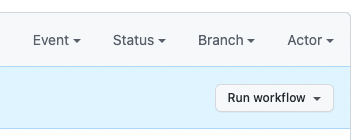
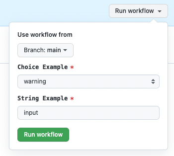

# Manual Workflows

Workflows can be triggered by one of the following manual interactions:

1. GitHub API
2. GitHub CLI
3. GitHub GUI (browser interface)

There are a couple of requirements in order for this to be enabled on a workflow:

1. The workflow must be in the default branch
2. The workflow must contain the `workflow_dispatch` event.

The following exercise will walk you through creating a manually triggered workflow, and then have you perform a manual execution through the GitHub GUI.

## Step 1: Create a new workflow to be triggered manually
The only step in this exercise is to add the workflow to your default branch directly.

1. Checkout the **default** branch of your repository
2. Create a new file named `.github/workflows/manual.yaml`
3. Copy the contents below to the newly created file:

```yaml
name: Manual Workflow
on:
  workflow_dispatch:
    inputs:
      choice-example:
        description: Choice Example
        required: true
        default: warning
        type: choice
        options:
        - info
        - warning
        - debug
      string-example:
        description: String Example
        required: true
        default: input
        type: string
jobs:
  do-things:
    name: Do Things Manually
    runs-on: ubuntu-latest
    steps:
      - name: Do A Thing
        run: echo "I've done a thing manually with '${{ inputs.choice-example }}' and '${{ inputs.string-example }}'!"
```

4. Add, commit, and push your changes to the default branch.
5. Go to your repository, and view the Actions tab to see the workflow you created (`Manual Workflow`)

The result will be a button (when viewing your workflow) you can use to execute the workflow.



## Step 2: Execute the workflow

1. From the workflow view (see previous step):
2. Click the "Run workflow" drop down button and then the green "Run Workflow" button:



The result will be an execution of the workflow above.

## Step 3: Clean Up
No further steps are needed as you committed directly to the default branch.