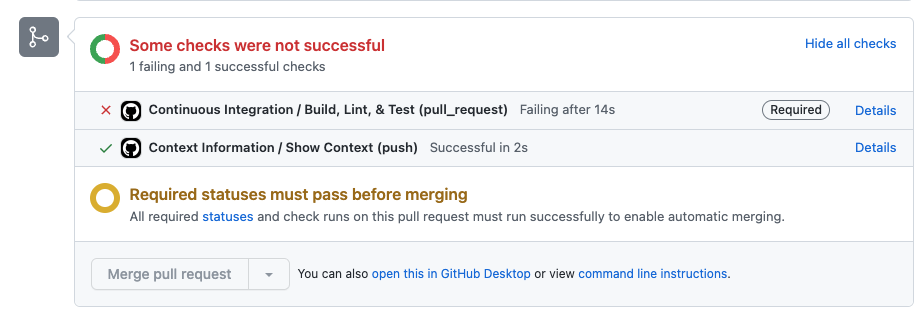

# Continuous Integration
A common pattern for continuous integration involves using pull requests to trigger testing & other automation tasks.

In the exercise below, we will walk through adding linting & testing for pull requests for a sample Golang application. This will trigger on pull request creation, as well as updates to code in the branch that the PR references.

## Step 1: Create a workflow that triggers on pull request creation
1. Checkout the **default** branch of your repository
2. Create a new file named `.github/workflows/ci-cd.yaml`
3. Copy the contents below to the newly created file:

```yaml
name: Continuous Integration & Delivery
on:
  pull_request:
  workflow_dispatch:
defaults:
  run:
    shell: bash
jobs:
  ci:
    name: Continuous Integration
    runs-on: ubuntu-latest
    defaults:
      run:
        working-directory: golang_app
    steps:
      - name: Clone
        uses: actions/checkout@v3.1.0
      - name: Get Dependencies
        run: go get app
      - name: Build
        run: go build
      - name: Run Linting
        uses: golangci/golangci-lint-action@v3
        with:
          working-directory: golang_app
      - name: Run Tests
        run: go test
```

4. Add, commit, and push your changes to the default branch.
5. Go to your repository, and view the Actions tab to see the workflow you created (`Continuous Integration`)

The result will be a workflow you can execute manually and automatically triggered by a pull request.

## Step 2: Enable branch protection on your **default** branch
Branch protection is one of the feature GitHub has that allows you to control who, what, and when a branch can be pushed to. For continuous integration, continuous delivery, and continuous deployment, this feature is integral. In the below step, we will enable this so that no "bad code" can make it through.

1. Enable branch protection for you **default** branch ([instructions](https://docs.github.com/en/repositories/configuring-branches-and-merges-in-your-repository/defining-the-mergeability-of-pull-requests/managing-a-branch-protection-rule))
2. After adding the branch name pattern, use the following settings. Leave everything unchecked except:
   1. `Require a pull request before merging`
   2. `Require status checks to pass before merging`
   3. Search for and add `Build, Lint, & Test` as a required status check (will appear once #2 is checked)
   4. `Do not allow bypassing the above settings` (required for admins)

## Step 3: Add a new branch and add some "bad" code
Now that the **default** branch is protected, we will add some "bad" code that will fail our linting. This will give us an example of how required status checks will prevent us from making mistakes.

1. From the **default** branch of your repository, create a new branch of code called `feature/bad`
2. Replace the contents of the file [golang_app/main.go](./golang_app/main.go) with the contents in [./golang_replacements/13-unnused-func.go](./golang_replacements/13-unnused-func.go)

3. Add & commit your changes, then push your branch.
4. Go to your repository, click the `Pull Requests` tab, and open a pull request to merge `feature/bad` to your **default** branch.

The result will be the inability to merge (the button will be disabled) because the status check for `Build, Lint, & Test` will fail the `Lint` step. This is how you ensure developer accountability and a quality of code.



Checks that are required have the `Required` badge next to them. Further checks _could_ be added to include static code analysis and more.

5. Close the PR (do not merge)
6. Delete the `feature/bad` branch