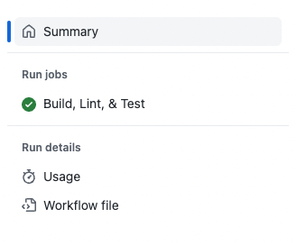
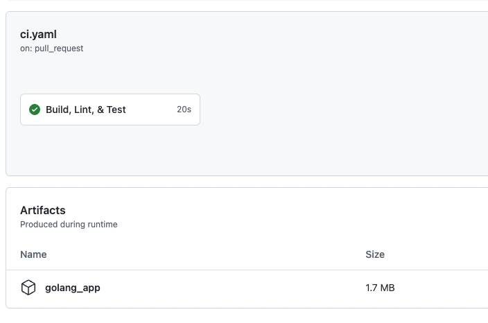

# Artifacts
GitHub offers built-in artifact functionality for saving and reusing artifacts across jobs. These artifacts can simply be described as some kind of output from a build process. This could be a binary, supporting files, or pretty much anything you want to pass from one job to the next.

The exercise below will walk you through updating the previously created `Continuous Integration` workflow (see [13-Continuous-Integration](./13-Continuous-Integration.md)) with the artifact action that will handle saving the artifact created from our `Golang` build process. We will later use this to continuously deliver a Docker image with our artifact (see [16-Packages](./16-Packages.md)).

## Prerequisite Exercises
- [13-Continuous-Integration](./13-Continuous-Integration.md)

## Step 1: Add the artifact save action
By adding the public action `actions/upload-artifact` to our `Continuous Integration` workflow, we have an easy-to-use way of working with the Artifacts API.

1. From the **default** branch of your repository, create a new branch of code called `feature/artifacts`
2. Open the file named `.github/workflows/ci-cd.yaml`
3. Replace the contents of the file with:

```yaml
name: Continuous Integration & Delivery
on:
  pull_request:
  workflow_dispatch:
defaults:
  run:
    shell: bash
jobs:
  ci:
    name: Continuous Integration
    runs-on: ubuntu-latest
    defaults:
      run:
        working-directory: golang_app
    steps:
      - name: Clone
        uses: actions/checkout@v3.1.0
      - name: Get Dependencies
        run: go get app
      - name: Build
        run: go build
      - name: Run Linting
        uses: golangci/golangci-lint-action@v3
        with:
          working-directory: golang_app
      - name: Run Tests
        run: go test
      - name: Store Artifact
        uses: actions/upload-artifact@v3.1.0
        with:
          name: golang_app
          path: golang_app/app
```

4. Add & commit your changes, then publish your branch.
5. Go to your repository, and view the Pull Requests tab.
6. Create a pull request to merge `feature/artifacts` into your **default** branch.
7. Click the `Show All Checks` link on the status checks in your pull request, then click the `Details` link next to `Continuous Integration`.


8. Click the `Summary` link on the left-hand navigation.



The result will be an artifact that authenticated users can download. Additionally, this artifact can be used in deployment or other automation using the `actions/artifact-download` action.

It should be noted that artifact retention is only as long [configured](https://docs.github.com/en/organizations/managing-organization-settings/configuring-the-retention-period-for-github-actions-artifacts-and-logs-in-your-organization) for your enterprise or organization.



## Step 2: Merge the changes to your default branch and update your local repository

1. Click the green `Merge pull request` button on the pull request from step 1.6. This will put your code into the main branch.
2. Delete the published branch created in [Step 1](#step-1-add-the-artifact-save-action)
3. Checkout to your default branch locally and pull down the changes.